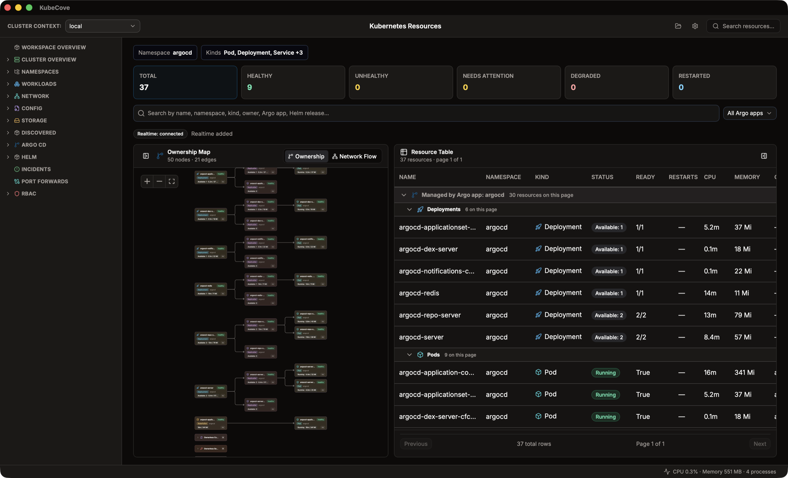
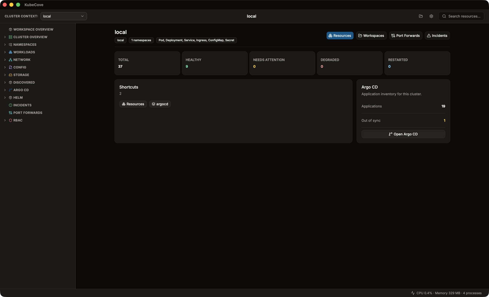
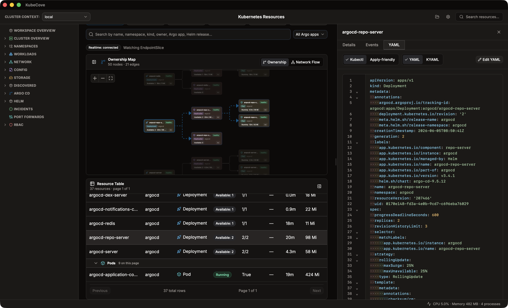

# KubeCove

KubeCove is a local desktop workspace for Kubernetes operations. It is built for operators and app developers who need to move from cluster scope to namespace, application, resource state, topology, events, logs, metrics, YAML, Helm metadata, Argo CD signals, and RBAC context without losing their place.

The current beta is inspection-first with governed Pod and selector-backed Service port-forward sessions, exact-Pod guarded exec sessions, and selected-resource YAML apply. KubeCove does not deploy agents into clusters, does not expose raw kubeconfig contents to React, and does not let the frontend run arbitrary shell commands. The architecture is ready for guarded cluster operations, but broad apply, delete, scale, sync, and rollback workflows are not shipped unless a typed Rust-side command and explicit UX guardrails exist.

Current version metadata: `0.6.6`.



## Get KubeCove

Use the beta installers from [GitHub Releases](https://github.com/Timpan4/kubecove/releases) when you want to test the app.

- macOS: `.dmg`
- Windows: NSIS setup executable
- Linux: `.AppImage`, `.deb`, or `.rpm` when present

Beta installers are unsigned at the OS package level, so macOS Gatekeeper or Windows SmartScreen may require an explicit approval step. In-app updater artifacts are signed through the Tauri updater key.

## Getting Started

1. Install KubeCove from a release installer and approve the Gatekeeper or SmartScreen prompt if your OS shows one.
2. Make sure a kubeconfig with at least one readable context exists. KubeCove discovers contexts from `$KUBECONFIG` and the default kubeconfig location without sending their contents to the UI.
3. Launch KubeCove and create a workspace: pick a context, optionally narrow it to specific namespaces and kinds, and open it.
4. Browse from the workspace overview into resources, topology, events, logs, metrics, YAML, Argo CD, Helm, and RBAC views. Cluster-changing actions stay behind explicit confirmation.



## Current Capabilities

- Local kubeconfig context discovery without sending raw kubeconfig data to the frontend.
- Saved workspaces for context, namespace, kind, filter, shortcut, and layout scope.
- Namespace-first and context-first resource browsing across discovered Kubernetes kinds.
- Fast resource tables with namespace, kind, health, search, Argo CD app, and owner filters.
- Resource inspection through details, YAML, events, logs, metrics, and topology views.
- Argo CD CRD detection with Application, ApplicationSet, and AppProject browsing.
- Helm release detection, details, and reconciliation from cluster metadata.
- RBAC summaries and risk indicators.
- Guarded Pod and selector-backed Service port-forward sessions with local-only listeners.
- Guarded exact-Pod exec sessions with explicit target and command confirmation.
- Guarded selected-resource YAML apply with dry-run diff, Secret protection, and explicit confirmation.
- Unsigned beta desktop installers for macOS, Windows, and Linux.



## Development

Requirements:

- Bun
- Rust and Cargo
- Tauri v2 system prerequisites for your OS
- A local kubeconfig with at least one readable context

Run the desktop app:

```sh
bun install
bun run tauri dev
```

Useful checks:

```sh
bun run typecheck
bun test
bun run rust:check
bun run check
```

Build a desktop bundle:

```sh
bun run tauri build
```

Validate the current `origin/main` release metadata:

```sh
bun run release:dry-run
```

Create releases from GitHub Actions with the `Prepare Release PR` workflow.

## Safety Model

KubeCove keeps Kubernetes access behind Rust-side Tauri commands. Normal list, get, discovery, watch, logs, events, metrics, Argo CD, Helm, and RBAC flows use `kube-rs` and frontend-safe serde contracts.

Pod and selector-backed Service port-forwarding follows [ADR 0003](docs/decisions/0003-guarded-live-sessions.md): exact targets, local-only listeners, visible sessions, and Rust-side Kubernetes access.

Pod exec follows [ADR 0005](docs/decisions/0005-guarded-pod-exec-sessions.md): exact Pod targets, explicit argv, visible sessions, and no frontend shell bridge.

Selected-resource YAML apply follows [ADR 0006](docs/decisions/0006-guarded-selected-resource-yaml-apply.md): the edited object must match the selected resource, multi-document YAML and redacted Secrets are blocked, dry-run diff runs before apply, and the final apply needs explicit confirmation.

Future cluster-changing workflows must follow [ADR 0004](docs/decisions/0004-guarded-cluster-operations.md): typed commands, visible target scope, confirmation, user-visible errors, and permission-aware UX. CLI-backed, Argo CD API, sync, rollback, broad apply, or broad filesystem workflows need focused design before they become product paths.

## Stack

- Tauri v2
- React and TypeScript
- Bun for JavaScript package management and scripts
- Rust backend
- `kube-rs` for Kubernetes API access
- TanStack Router, Query, and Table
- Zustand for local UI state
- Tailwind CSS and shadcn/ui primitives
- React Flow for topology surfaces

## Docs

Start with the [docs index](docs/README.md). High-signal entry points:

- [Product Vision](docs/product-vision.md)
- [Architecture Blueprint](docs/architecture-blueprint.md)
- [Milestones](docs/milestones.md)
- [Release Guide](docs/release.md)
- [Agent Guide](AGENTS.md)

## License

KubeCove is licensed under the [GNU Affero General Public License v3.0 or later](LICENSE).
