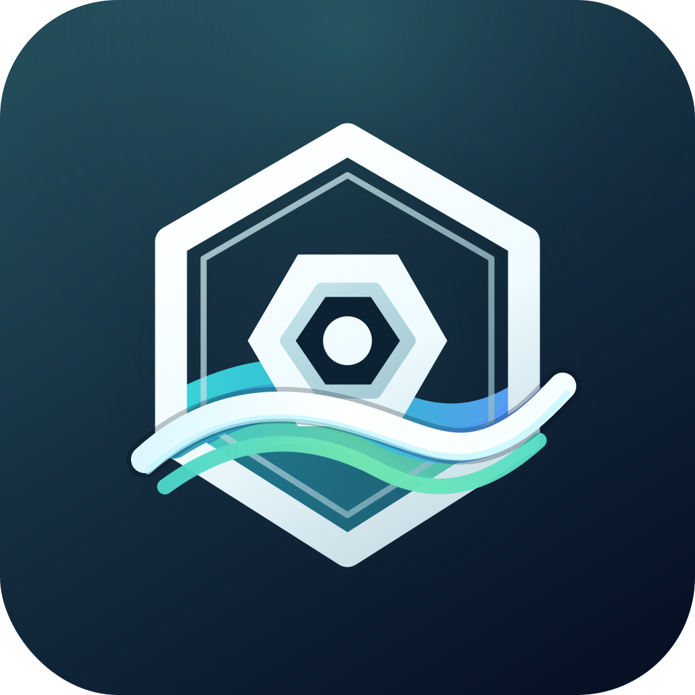

# KubeCove

<table>
  <tr>
    <td width="180" valign="top">
      
    </td>
    <td valign="top">
      <p><strong>A context-first desktop workspace for Kubernetes operations.</strong></p>
      <p>KubeCove is a local Kubernetes IDE focused on fast, safe cluster exploration today and deliberate operational workflows later. It keeps Kubernetes access on the Rust side of the Tauri boundary, starts from contexts and namespaces, and helps you move from workspace scope to resources, Argo CD signals, events, logs, YAML, and detail views without losing the operational thread.</p>
    </td>
  </tr>
</table>

## Quick Start

### Beta Installers

Beta installers for macOS, Windows, and Linux are published under [GitHub Releases](https://github.com/Timpan4/kubecove/releases). Use those installers when you only want to test KubeCove; the source setup below is for development.

Requirements:

- Bun
- Rust and Cargo
- Tauri v2 system prerequisites for your OS
- A local kubeconfig with at least one readable context

Install dependencies and start the desktop app:

```sh
bun install
bun run tauri dev
```

Useful checks:

```sh
bun run typecheck
bun test
bun run rust:check
bun run check
```

Build a desktop bundle:

```sh
bun run tauri build
```

Create a beta release from the current `origin/main` commit:

```sh
bun run release
```

## What Works Today

- list local kubeconfig contexts
- select a context and list namespaces
- create and restore local workspaces
- filter one or more namespaces globally
- discover and list Kubernetes resource kinds
- list resources in fast tables with search, status, age, owner, Argo CD, and Helm signals
- show resource details, events, logs, and read-only YAML
- detect Argo CD CRDs and browse Applications, ApplicationSets, and AppProjects
- keep kubeconfig contents and cluster credentials out of the frontend

## Safety Model

KubeCove is intentionally local-first. Nothing is deployed into clusters, kubeconfig stays on the Rust side of the Tauri boundary, and normal Kubernetes API access goes through `kube-rs` rather than shelling out to `kubectl`.

The MVP is read-only. Future mutation workflows are planned, but they need explicit guardrails, permission-aware UX, and an Architecture Decision Record before they become part of the product.

## Stack

- Tauri v2
- React and TypeScript
- Bun as the JavaScript runtime and package manager
- Rust backend
- `kube-rs` for Kubernetes API access
- TanStack Router, Query, and Table
- Zustand for local UI state
- Tailwind CSS and shadcn/ui

Future candidates include Monaco Editor for YAML, richer topology views, SQLite for local saved state, and optional sidecars or fallbacks for `kubectl`, Helm, and Argo CD.

## Docs

See the [docs index](docs/README.md) for the full set, ordered by reading priority. Top entry points: [Product Vision](docs/product-vision.md), [Architecture Blueprint](docs/architecture-blueprint.md), [Milestones](docs/milestones.md), and the [Agent Guide](AGENTS.md).
