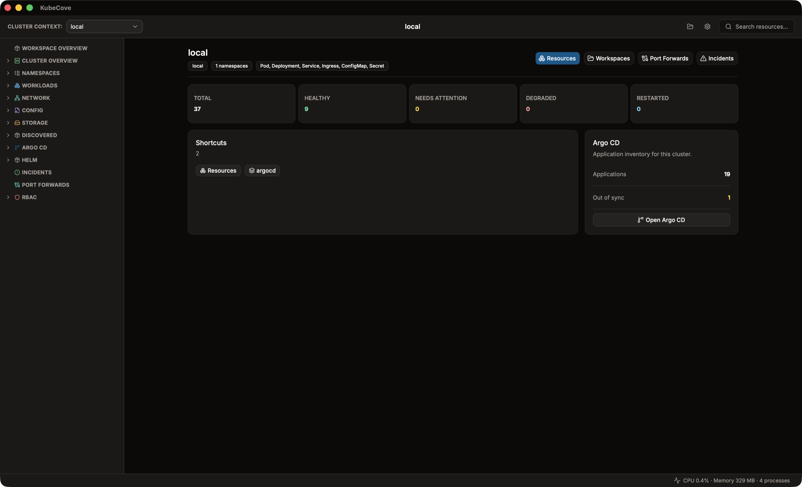
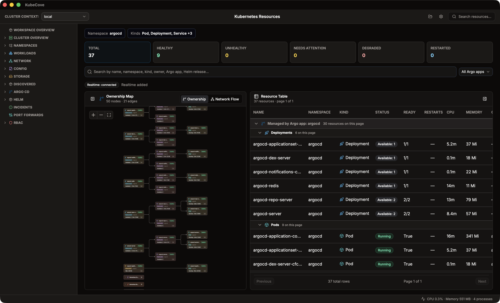
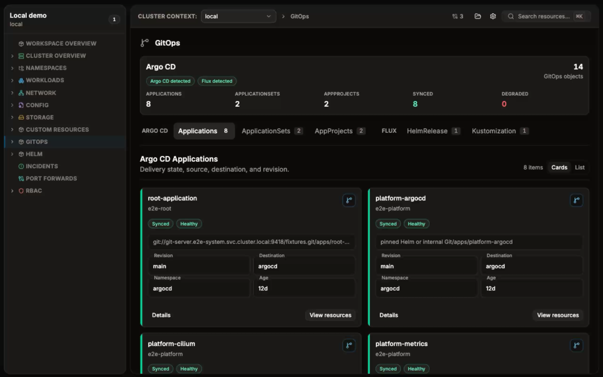

# KubeCove

[](https://app.codspeed.io/Timpan4/kubecove?utm_source=badge)

KubeCove is a fast, local Kubernetes desktop UI—a Kubernetes GUI for cluster inspection, GitOps, and troubleshooting. It is built for application developers and cluster operators who want to browse resources across kubeconfig contexts and namespaces, understand ownership and topology, inspect Argo CD, Flux, and Helm state, and use guarded cluster operations without leaving the local workspace.

KubeCove is a calm, evidence-oriented workspace: see what is running, what owns it, and what is broken before acting.

[Download the latest release](https://github.com/Timpan4/kubecove/releases/latest) · [Getting started](https://github.com/Timpan4/kubecove/wiki/Install-and-Update) · [Public Wiki](https://github.com/Timpan4/kubecove/wiki)

## What KubeCove does

- Browse Kubernetes resources across cluster contexts, namespaces, built-in kinds, and discovered custom resources.
- Inspect workload health, ownership relationships, topology, conditions, events, logs, metrics when available, YAML, and deployment revisions.
- View Argo CD and Flux objects alongside live Kubernetes resources, and review Helm release and reconciliation evidence.
- Use target-scoped workflows for Pod and Service port forwarding, exact-Pod exec, scale, rollout restart, selected-resource YAML apply, and delete.
- Run the supported Argo CD refresh and sync operations through explicit, reviewed workflows.

## Why KubeCove exists

Kubernetes troubleshooting often spans `kubectl`, a terminal UI, a GitOps interface, and one or more dashboards. KubeCove focuses on the handoff between a signal and the evidence behind it: a local, scope-aware view that keeps the context, namespace, ownership, and exact resource target visible while you investigate. It complements those tools rather than trying to replace all of them.

## How it fits with other tools

| Tool or interface | Where KubeCove fits |
| --- | --- |
| `kubectl` | Keep using it for scripts and command-line workflows. KubeCove adds visual browsing, relationships, evidence, and guarded forms. |
| `k9s` | `k9s` is a terminal UI; KubeCove is a desktop GUI with a different interaction model, including detail panes, topology, and GitOps or Helm context. |
| Argo CD UI | The Argo CD UI remains the specialized interface for Argo CD administration. KubeCove places supported Argo CD state beside live Kubernetes resources and exposes only selected connected operations. |
| Hosted dashboards | KubeCove runs locally with the user's kubeconfig. It is not a hosted dashboard or a multi-tenant Kubernetes management service. |

These tools remain useful. KubeCove is a local Kubernetes workspace for the parts of cluster inspection and troubleshooting where scope, relationships, and an explicit target matter.

## Supported integrations

| Integration | Current scope |
| --- | --- |
| Kubernetes | Uses the Kubernetes API through selected kubeconfig contexts. Resource kinds and custom resources are discovered from the cluster when needed. |
| Argo CD | Inspects Argo CD resources through Kubernetes CRDs. An optional connected transport supports manual external HTTPS URLs and private tunnels to discovered eligible Kubernetes Services for bounded application inspection plus supported refresh and sync operations. Connected inspection can visibly fall back to a complete Kubernetes view when required connected reads fail; reviewed operations stay bound to the transport selected at confirmation. |
| Flux | Inspects installed Flux CRDs, status, source references, revisions, and inventory. Flux workflows are inspection-only in the current release. |
| Helm | Inspects Helm release storage, decoded manifest references, and conservative live-resource reconciliation evidence. Helm install, upgrade, rollback, uninstall, and release mutation are not provided. |

## Security and local operation

KubeCove is a Tauri desktop application. The Svelte frontend reaches Kubernetes through typed Tauri commands and the Rust backend:

- Kubeconfig contents, tokens, client keys, and certificate data remain backend-side rather than becoming normal frontend state.
- The application deploys no cluster agent and exposes no generic local-shell bridge. Pod exec is a specific, target-scoped workflow.
- Cluster-changing actions identify one exact target and require explicit confirmation. Port forwards bind to loopback.
- Connected Argo CD credentials are session-only unless the user explicitly chooses the native operating-system keyring.

## Getting started

1. [Download an installer from the latest release](https://github.com/Timpan4/kubecove/releases/latest).
2. Make a readable Kubernetes context available through `$KUBECONFIG` or the standard default kubeconfig location.
3. Launch KubeCove, create a workspace, choose a context, and narrow namespaces or resource kinds when useful.
4. Follow the [installation and first-use guide](https://github.com/Timpan4/kubecove/wiki/Install-and-Update) for platform notes and the [public Wiki](https://github.com/Timpan4/kubecove/wiki) for task guides.

On Linux with Nix, run a checkout directly:

```sh
nix run
```

Run a tagged release by replacing `X.Y.Z` with its version:

```sh
nix run github:Timpan4/kubecove/app-vX.Y.Z
```

Installers are beta builds and may show platform trust prompts. KubeCove does not include your cluster credentials, `kubectl`, Helm, or GitOps CLIs.

## Screenshots







## Documentation

- [Getting started and downloading](https://github.com/Timpan4/kubecove/wiki/Install-and-Update)
- [Kubernetes resource browser and topology](https://github.com/Timpan4/kubecove/wiki/Resource-Browser)
- [Argo CD and Flux integration](https://github.com/Timpan4/kubecove/wiki/GitOps-Argo-CD-and-Flux)
- [Helm inspection and reconciliation](https://github.com/Timpan4/kubecove/wiki/Helm-Reconciliation)
- [Security, data handling, and architecture](https://github.com/Timpan4/kubecove/wiki/Safety-Data-and-Architecture)
- [Product and architecture](docs/product-and-architecture.md)

## Contributing and security

[Contributing guide](CONTRIBUTING.md) · [Security policy](SECURITY.md)

## Stack

KubeCove is built with Svelte and Tauri/Rust. [Product and architecture](docs/product-and-architecture.md) covers the desktop trust boundary and engineering structure.

## License

KubeCove is licensed under [GNU Affero General Public License v3.0 or later](LICENSE).
