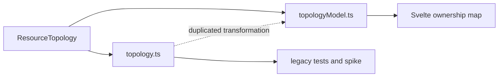

# Architecture Deepening Review

Status: design agreed. Implementation remains split into focused follow-up PRs.

## Recommendation

Consolidate topology transformation first. It has the clearest deletion-test
result, is reversible, improves the production test surface, and does not
change an ADR-governed seam.

The target shape is one topology module whose interface is shared by the
ownership map, diagnostics spike, and tests. Graph, layout, selection, root
filtering, and viewport calculations remain implementation details.

## Agreed delivery order

1. Consolidate topology transformation.
2. Unify Argo resource projections.
3. Deepen Workspace Navigation.
4. Deepen Port Forward and Pod Exec lifecycles.
5. Move feature ownership out of `AppSurfaces.svelte`.

The first three changes are independent and isolated. Lifecycle deepening must
land before live-session feature ownership moves.

## Designs

### 1. Collapse parallel topology transformations

Strength: **Strong**

Files:

- `src/features/resources/topology.ts`
- `src/features/resources/topologyModel.ts`
- `src/features/resources/topology-graph.ts`
- `src/features/resources/topology-viewport.ts`
- `src/features/resources/OwnershipMap.svelte`
- `src/features/resources/topology.test.ts`
- `tests/topology*.test.ts`

Problem:

- Production uses `topologyModel.ts`.
- Viewport types, diagnostics spike, property tests, and older topology tests
  still cross `topology.ts`.
- Layout, selection, and root-filter behavior therefore have two interfaces
  and two test surfaces.

Agreed design:

- Delete the legacy topology implementation and rename `topologyModel.ts` to
  the canonical `topology.ts` module.
- Hide graph, layout, selection, root filtering, and viewport helpers inside
  its implementation.
- Use the production interface for behavior tests. Keep focused internal tests
  only for mathematical invariants such as stable ordering, acyclic layout,
  and viewport bounds.
- Migrate the diagnostics spike instead of preserving a compatibility
  interface.

Deletion test: deleting `topology.ts` removes parallel implementation. Only
live type imports and diagnostics node-ID use need relocation.

Benefits:

- Locality: one topology fix.
- Leverage: production and tests share one interface.
- Delete parallel implementation and obsolete tests.

### 2. Deepen feature surface modules

Strength: **Worth exploring**

Files:

- `src/app/svelte/AppSurfaces.svelte`
- `src/app/svelte/GitOpsSurface.svelte`
- `src/app/svelte/HelmSurface.svelte`
- `src/app/svelte/IncidentSurface.svelte`
- `src/app/svelte/LiveSessionsSurface.svelte`
- `src/app/svelte/RbacSurface.svelte`
- `src/app/svelte/*SurfaceModel.ts`
- `tests/svelte-*-surface-model.test.ts`

Problem:

- `AppSurfaces.svelte` owns feature queries, partial-failure policy, selection,
  actions, and persistence.
- Child surface modules mainly render a wide interface that mirrors the parent
  implementation.
- GitOps, incident, Helm, and live-session tests read or concatenate parent and
  child source files instead of crossing one feature interface.

Agreed design:

- Let each feature module own its query, selection, action, and rendering
  implementation.
- Reduce `AppSurfaces.svelte` to routing.
- Preserve the existing `TauriClient` seam and its desktop and browser
  adapters.
- Expose one Svelte entry module per feature; keep query and model helpers at
  internal seams.
- Delete source-text tests as each feature moves and replace them with behavior
  tests through the feature interface.
- Migrate live sessions first, then Incident Workbench, GitOps, Helm, and RBAC.
- Do not introduce a generic surface module.

Benefits:

- Locality: feature policy stays with its feature.
- Leverage: callers and tests cross one feature interface.
- Source-text tests can become behavior tests.

### 3. Concentrate workspace navigation transitions

Strength: **Strong**

Files:

- `src/app/svelte/WorkspaceShell.svelte`
- `src/app/svelte/workspaceShellModel.ts`
- `src/lib/path-state.ts`
- `src/lib/tree-nav.ts`
- `src/app/svelte/SidebarTree.svelte`
- `src/app/svelte/CommandPalette.svelte`
- `tests/svelte-workspace-shell-model.test.ts`

Problem:

- Navigation handlers manually reset overlapping view, tree, resource,
  GitOps, Helm, incident, and path-state fields.
- Transition invariants leak across `openResources`, `openArgo`,
  `openIncidents`, `selectNode`, `selectResource`, and cluster changes.
- Tests contain 18 direct reads of `WorkspaceShell.svelte` source.

Agreed design:

- Create the canonical `workspaceNavigation.ts` module.
- Model navigation as pure current-state plus domain-intent transitions.
- Keep tree derivation, persisted-path encoding, restore validation, and
  transition invariants behind the same interface.
- Let the shell perform UI effects and storage reads and writes.
- Do not add a storage adapter while storage behavior has one implementation.

Benefits:

- Locality: one transition rule.
- Leverage: shell, sidebar, palette, and tests share it.
- Exact reset-snippet tests become unnecessary.

### 4. Deepen frontend live-session lifecycle

Strength: **Worth exploring**

Files:

- `src/app/svelte/App.svelte`
- `src/app/svelte/WorkspaceShell.svelte`
- `src/app/svelte/AppSurfaces.svelte`
- `src/app/svelte/ActiveLiveSessionsButton.svelte`
- `src/app/svelte/LiveSessionsSurface.svelte`
- `src/features/live-sessions/*.ts`
- `src/features/resource-detail/PortForwardTab.svelte`
- `src/features/resource-detail/ExecTab.svelte`

Problem:

- Scope cleanup, restore, polling, workspace filtering, preset matching,
  reconnect, stop, invalidation, and errors are spread across six callers.
- Existing helpers expose primitives but do not hide lifecycle behavior.

Agreed design:

- Deepen separate Port Forward Lifecycle and Pod Exec Lifecycle modules; their
  restore and interaction semantics are materially different.
- Let each lifecycle own query options, post-action invalidation, and explicit
  workspace-scope and kubeconfig-source policy.
- Keep transient presentation state in UI modules.
- Expose a small discriminated read model for combined counts, sorting,
  filtering, and display. Delegate actions to the respective lifecycle.
- Reuse the existing typed Tauri adapter and keep backend implementations
  separate.

ADR constraint: preserve ADR 0003 and ADR 0005 target, confirmation, lifecycle,
and session rules.

Benefits:

- Locality: one lifecycle policy.
- Leverage: header, manager, shell, and detail surfaces share it.
- Port-forward and Pod exec remain two real adapters at the seam.

### 5. Make Argo resource projections single-source

Strength: **Worth exploring**

Files:

- `src-tauri/src/commands/argo/applications.rs`
- `src-tauri/src/commands/argo/appsets.rs`
- `src-tauri/src/commands/argo/appprojects.rs`
- `src-tauri/src/commands/gitops_crd.rs`

Problem:

- Application, ApplicationSet, and AppProject list and detail commands repeat
  summary construction.
- Metadata, age, status, source, and destination changes can land on one path
  without the other.

Agreed design:

- Let each Argo resource module own one optional `DynamicObject` projection.
- Reuse that projection from list and detail commands.
- Keep command names and the Kubernetes-API-first interface unchanged.
- Preserve malformed-data behavior: list skips malformed objects; detail
  returns a typed `AppError`.
- Test projections directly with minimal `DynamicObject` values. Keep command
  tests focused on discovery and fetch behavior.
- Do not introduce a generic Argo projection module.

Benefits:

- Locality: projection logic exists once.
- Leverage: list and detail share it.
- Tests exercise the projection directly.

## Constraints

- Preserve typed Tauri commands and Rust-owned Kubernetes access.
- Keep kubeconfig and credentials out of the frontend.
- Preserve ADR 0003, ADR 0005, and ADR 0007 behavior.
- Do not introduce a seam with only one adapter.
- Prefer deletion and replacement over another compatibility module.

## Decision record threshold

No new ADR is needed. These are reversible module refactors that preserve the
existing Tauri, Kubernetes access, and guarded-operation decisions.
