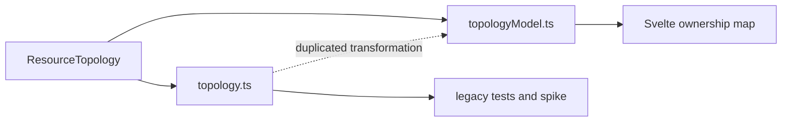

# Architecture Deepening Review

Status: exploration only. No interface or implementation has been selected.

## Recommendation

Consolidate topology transformation first. It has the clearest deletion-test
result, is reversible, improves the production test surface, and does not
change an ADR-governed seam.

The target shape is one topology module whose interface is shared by the
ownership map, diagnostics spike, and tests. Graph, layout, selection, root
filtering, and viewport calculations remain implementation details.

## Candidates

### 1. Collapse parallel topology transformations

Strength: **Strong**

Files:

- `src/features/resources/topology.ts`
- `src/features/resources/topologyModel.ts`
- `src/features/resources/topology-graph.ts`
- `src/features/resources/topology-viewport.ts`
- `src/features/resources/OwnershipMap.svelte`
- `src/features/resources/topology.test.ts`
- `tests/topology*.test.ts`

Problem:

- Production uses `topologyModel.ts`.
- Viewport types, diagnostics spike, property tests, and older topology tests
  still cross `topology.ts`.
- Layout, selection, and root-filter behavior therefore have two interfaces
  and two test surfaces.

Deepening direction:

- Keep one topology module interface.
- Hide graph, layout, selection, root filtering, and viewport helpers inside
  its implementation.
- Move tests to the production interface, retaining focused internal tests
  only where they prove an invariant.

Deletion test: deleting `topology.ts` removes parallel implementation. Only
live type imports and diagnostics node-ID use need relocation.

Benefits:

- Locality: one topology fix.
- Leverage: production and tests share one interface.
- Delete parallel implementation and obsolete tests.

### 2. Deepen feature surface modules

Strength: **Strong**

Files:

- `src/app/svelte/AppSurfaces.svelte`
- `src/app/svelte/GitOpsSurface.svelte`
- `src/app/svelte/HelmSurface.svelte`
- `src/app/svelte/IncidentSurface.svelte`
- `src/app/svelte/LiveSessionsSurface.svelte`
- `src/app/svelte/RbacSurface.svelte`
- `src/app/svelte/*SurfaceModel.ts`
- `tests/svelte-*-surface-model.test.ts`

Problem:

- `AppSurfaces.svelte` owns feature queries, partial-failure policy, selection,
  actions, and persistence.
- Child surface modules mainly render a wide interface that mirrors the parent
  implementation.
- GitOps, incident, Helm, and live-session tests read or concatenate parent and
  child source files instead of crossing one feature interface.

Deepening direction:

- Let each feature module own its query, selection, action, and rendering
  implementation.
- Reduce `AppSurfaces.svelte` to routing.
- Preserve the existing `TauriClient` seam and its desktop and browser
  adapters.

Benefits:

- Locality: feature policy stays with its feature.
- Leverage: callers and tests cross one feature interface.
- Source-text tests can become behavior tests.

### 3. Concentrate workspace navigation transitions

Strength: **Strong**

Files:

- `src/app/svelte/WorkspaceShell.svelte`
- `src/app/svelte/workspaceShellModel.ts`
- `src/lib/path-state.ts`
- `src/lib/tree-nav.ts`
- `src/app/svelte/SidebarTree.svelte`
- `src/app/svelte/CommandPalette.svelte`
- `tests/svelte-workspace-shell-model.test.ts`

Problem:

- Navigation handlers manually reset overlapping view, tree, resource,
  GitOps, Helm, incident, and path-state fields.
- Transition invariants leak across `openResources`, `openArgo`,
  `openIncidents`, `selectNode`, `selectResource`, and cluster changes.
- Tests contain 18 direct reads of `WorkspaceShell.svelte` source.

Deepening direction:

- Deepen the existing workspace model around navigation transitions and path
  persistence.
- Keep tree derivation and transition invariants behind the same interface.
- Do not add a storage adapter unless storage behavior actually varies.

Benefits:

- Locality: one transition rule.
- Leverage: shell, sidebar, palette, and tests share it.
- Exact reset-snippet tests become unnecessary.

### 4. Deepen frontend live-session lifecycle

Strength: **Worth exploring**

Files:

- `src/app/svelte/App.svelte`
- `src/app/svelte/WorkspaceShell.svelte`
- `src/app/svelte/AppSurfaces.svelte`
- `src/app/svelte/ActiveLiveSessionsButton.svelte`
- `src/app/svelte/LiveSessionsSurface.svelte`
- `src/features/live-sessions/*.ts`
- `src/features/resource-detail/PortForwardTab.svelte`
- `src/features/resource-detail/ExecTab.svelte`

Problem:

- Scope cleanup, restore, polling, workspace filtering, preset matching,
  reconnect, stop, invalidation, and errors are spread across six callers.
- Existing helpers expose primitives but do not hide lifecycle behavior.

Deepening direction:

- Deepen the current frontend live-session module behind the UI seam.
- Reuse the existing typed Tauri adapter.
- Keep port-forward and Pod exec backend implementations separate.

ADR constraint: preserve ADR 0003 and ADR 0005 target, confirmation, lifecycle,
and session rules.

Benefits:

- Locality: one lifecycle policy.
- Leverage: header, manager, shell, and detail surfaces share it.
- Port-forward and Pod exec remain two real adapters at the seam.

### 5. Make Argo resource projections single-source

Strength: **Worth exploring**

Files:

- `src-tauri/src/commands/argo/applications.rs`
- `src-tauri/src/commands/argo/appsets.rs`
- `src-tauri/src/commands/argo/appprojects.rs`
- `src-tauri/src/commands/gitops_crd.rs`

Problem:

- Application, ApplicationSet, and AppProject list and detail commands repeat
  summary construction.
- Metadata, age, status, source, and destination changes can land on one path
  without the other.

Deepening direction:

- Let each Argo resource module own one `DynamicObject` projection.
- Reuse that projection from list and detail commands.
- Keep command names and the Kubernetes-API-first interface unchanged.

Benefits:

- Locality: projection logic exists once.
- Leverage: list and detail share it.
- Tests exercise the projection directly.

## Constraints

- Preserve typed Tauri commands and Rust-owned Kubernetes access.
- Keep kubeconfig and credentials out of the frontend.
- Preserve ADR 0003, ADR 0005, and ADR 0007 behavior.
- Do not introduce a seam with only one adapter.
- Prefer deletion and replacement over another compatibility module.

## Suggested next step

Grill candidate 1 before implementation: confirm which `topology.ts` behavior
is still required, which tests cover production behavior, and which exports can
be deleted instead of moved.
