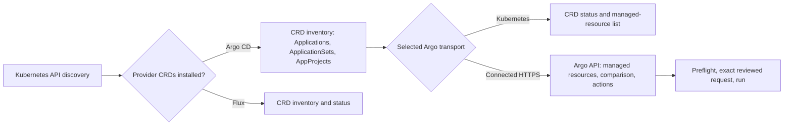

# GitOps: Argo CD and Flux

Use the GitOps screen to inspect provider CRDs in the selected Kubernetes context. See the [KubeCove Wiki](https://github.com/Timpan4/kubecove/wiki) for related guides.

## Detect providers and inventory

1. Open **GitOps** for the workspace and cluster context.
2. KubeCove discovers installed CRDs through the Kubernetes API.
3. Select a provider group to list its resources. Argo CD requires its Application CRD. Flux is detected when any supported Flux CRD is installed, and lists only installed kinds.

Argo CD inventory includes **Applications**, **ApplicationSets**, and **AppProjects**. Application rows expose sync and health status, source and destination details, and tracked-resource counts when the CRD supplies them. ApplicationSet and AppProject details are CRD-backed YAML, metadata, and status views.

Flux inventory is grouped into Sources, Kustomize, Helm, Notifications, and Image Automation. Each installed kind can show readiness, suspension, source reference, interval, applied revision, status message, and inventory entries when its CRD reports them.

## Inspect Argo CD Applications

Open an Application to review its delivery status, history, conditions, operation state, and managed resources. Select a managed resource for its identity, health, sync status, pruning requirement, and available server action list.

Choose one transport for each Argo Application view:

- **Kubernetes** reads the Argo Application CRD and its reported status through the selected cluster context. It can show status resources and history, but cannot claim an exact desired state or diff.
- **Connected Argo CD** uses the configured Argo CD HTTPS API for that workspace and cluster context. It returns Argo-managed resources and authoritative target, live, normalized-live, and predicted-live state for a resource comparison.

These are explicit transports. KubeCove does not automatically switch between them when one fails or lacks a capability.

## Run Argo CD operations

Operations are typed, allowlisted, scoped to one Application, and reviewed by preflight before they run.

| Transport | Available screen operations |
| --- | --- |
| Connected Argo CD | Refresh, hard refresh, and sync with optional revision, prune, dry-run, or force settings |
| Kubernetes | Refresh, hard refresh, and sync with the same reviewed settings |

Use this sequence:

1. Review the Application, transport, target revision, selected resources, and sync options.
2. Start refresh or sync. KubeCove preflights the exact request before submitting it.
3. For sync choices beyond the Application defaults, type the exact Application name to enable confirmation.
4. Run the reviewed request immediately. The preflight token is single-use, expires after one minute, and binds the run to the exact request reviewed at preflight.
5. Refresh the Application state after Argo CD accepts the operation. Acceptance is not proof that reconciliation has completed.

Connected operations require an active profile. Kubernetes operations require the Application namespace, current `resourceVersion`, and Kubernetes permission to patch the Application CRD. That check does not evaluate Argo CD RBAC. Exact target/live comparison requires a connected Argo CD profile.

## Connect Argo CD safely

Connected access is opt-in. Open the Argo CD category in **Settings** from an active workspace and cluster context to discover or connect a server, then enter a manual HTTPS server URL and authenticate with a token or local login credentials. Application details lets you choose among matching profiles and transports; it no longer manages connection profiles. A healthy matching profile is selected automatically unless you explicitly choose another. A discovered in-cluster Argo server may be shown as unavailable because this release has no service tunnel; use a reachable manual URL.

- Tokens, passwords, TLS configuration, and custom CA material stay in the Rust backend. The frontend receives typed summaries, not credentials.
- Without **Remember credential**, the token is memory-only. With it, KubeCove uses the native keyring; it has no plaintext credential fallback.
- The server URL must use HTTPS and cannot embed credentials. Insecure TLS and custom CA PEM are session-only and are not stored; re-enter either setting after disconnecting or restarting before reconnecting.
- Connected profiles are bound to the selected cluster context and workspace. A profile outside that scope cannot be used.
- Argo Secret `data` and `stringData` are redacted before they cross the desktop boundary, regardless of viewing preferences. The persisted redaction default is redact; any per-key reveal is transient.

## Inspect Flux

Flux is Kubernetes-API-first and inspection-only in this release. Use its installed CRDs to inspect resources, YAML, metadata, status, source references, revisions, and inventory.

Flux reconcile, suspend, resume, Git-writing actions, CLI integration, a connected Flux API transport, and mutation workflows are not available. Flux CRD status is not an exact desired-versus-live comparison.

## Resolve common failures

| Symptom | What to check |
| --- | --- |
| Argo CD or Flux is unavailable | Select the intended cluster context and confirm the provider CRDs are installed and readable. Argo detection requires the `argoproj.io` Application CRD. |
| A discovered Argo server is unavailable | Service tunneling is not in this release. Use a reachable manual HTTPS URL. |
| Connected inspection or an operation is unavailable | Connect a profile for the current workspace and cluster context. Recheck the URL, credentials, TLS settings, and server response. |
| Kubernetes operation is unavailable or unauthorized | Confirm Kubernetes RBAC allows patching the target Application, and that its namespace and current `resourceVersion` are present. This is separate from Argo CD RBAC. |
| Connected operation is denied | Check the authenticated Argo CD user's authorization for that Application and action, then preflight again. |
| Preflight expired, was already used, or changed | Start the action again and review the newly resolved request. Do not reuse the previous token. |

## Sources

Safety and transport behavior is defined by [ADR 0002](https://github.com/Timpan4/kubecove/blob/main/docs/decisions/0002-argocd-native-kubernetes-api-first.md), [ADR 0007](https://github.com/Timpan4/kubecove/blob/main/docs/decisions/0007-gitops-providers-kubernetes-api-first.md), [ADR 0013](https://github.com/Timpan4/kubecove/blob/main/docs/decisions/0013-argocd-connected-inspection-and-operations.md), [ADR 0014](https://github.com/Timpan4/kubecove/blob/main/docs/decisions/0014-runtime-secret-disclosure.md), and [ADR 0015](https://github.com/Timpan4/kubecove/blob/main/docs/decisions/0015-flux-inspection-roadmap.md).
