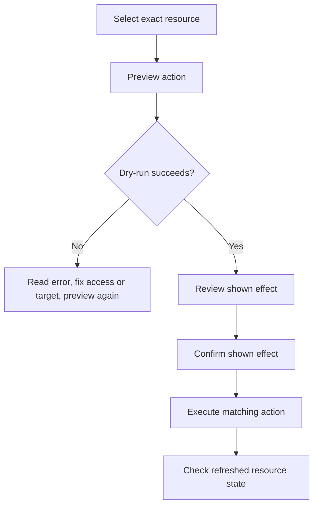

# Guarded Operations

Guarded Operations changes one selected Kubernetes resource through a fixed, typed action. Open Resource details, select resource, then open **Actions**. Before any action, read target card: context, namespace, kind, and name.

Related: [Resource Details](https://github.com/Timpan4/kubecove/wiki/Resource-Details) · [GitOps](https://github.com/Timpan4/kubecove/wiki/GitOps-Argo-CD-and-Flux) · [Helm](https://github.com/Timpan4/kubecove/wiki/Helm-Reconciliation) · [RBAC](https://github.com/Timpan4/kubecove/wiki/RBAC-and-Permissions)

## Prerequisites

- Select context and namespaced resource. Guarded actions require non-empty context, namespace, and name.
- Use kubeconfig identity authorized for requested action. Preview uses Kubernetes dry-run, so it also needs authorization.
- Confirm exact target before changing it. Operations never apply to a selector or resource group.

| Action | Supported kinds | Kubernetes permission |
| --- | --- | --- |
| Scale | Deployment, StatefulSet | `patch` |
| Rollout restart | Deployment, StatefulSet, DaemonSet | `patch` |
| Delete | Pod, ConfigMap | `delete` |

Other kinds show no guarded operation.

## Guard sequence

1. **Preview** sends dry-run request and shows effect. No cluster change occurs when preview succeeds.
2. App records fingerprint for preview: action, exact target, and desired replicas for scale.
3. **Confirm** `I understand the shown effect will change this exact resource.`
4. **Execute** only works with confirmation and matching preview fingerprint. Changing replica count clears preview and confirmation. Changing action or target requires new preview.
5. Successful execution clears preview and confirmation, then shows result. Resource detail watch refreshes details after matching resource-change event. Result confirms command response; inspect refreshed state before follow-up work.

## Scale workload

Use only Deployment or StatefulSet.

1. Open **Actions** for workload.
2. Enter **Desired replicas**. Use zero or greater.
3. Select **Preview scale**. Check context, namespace, kind, name, and replica count in shown effect.
4. Select confirmation checkbox.
5. Select **Scale workload**.
6. Inspect refreshed workload state. To undo intentional scale change, set prior replica count, preview new value, confirm, and execute again.

Scale patches `spec.replicas` on selected resource.

## Rollout restart

Use only Deployment, StatefulSet, or DaemonSet.

1. Open **Actions** for workload.
2. Select **Preview restart**. Review exact target and shown effect.
3. Select confirmation checkbox.
4. Select **Rollout restart**.
5. Inspect refreshed workload and rollout state before declaring restart complete.

Restart patches pod template annotation `kubecove.io/restartedAt`. It does not delete workload.

## Delete one resource

Use only Pod or ConfigMap.

1. Open **Actions** for Pod or ConfigMap.
2. Select **Preview delete**. Verify target card and preview both name same context, namespace, kind, and name.
3. Select confirmation checkbox.
4. Select destructive **Delete resource**.
5. Verify resource state after refresh. Result reports delete request; it does not prove resource has disappeared.

Delete targets one resource only. Preview identifies requested target; it is not dependent-resource analysis.

## Failure and recovery

- **Preview fails:** no action is executed. Read displayed Kubernetes error, correct context, namespace, target, or access, then preview again.
- **Confirmation or fingerprint error:** preview exact current action again, then confirm it.
- **Forbidden or unauthorized:** request least-privilege RBAC for matrix verb in target namespace. Do not retry until access is corrected.
- **Invalid replica count:** use zero or positive integer.
- **Request error after submission:** final cluster state may be unknown. Read resource state before retrying.
- **Delete result:** confirm absence before recreating resource or taking dependent action.

## GitOps and Helm caution

In **Details**, **Ownership** can show Argo, Helm, or GitOps ownership. If shown, use source repository or release workflow for desired-state changes. Guarded Operations changes live Kubernetes object only; it does not update GitOps source or Helm release values. Reconciliation can replace direct changes.

For managed resources, treat scale and restart as temporary operational changes unless owning workflow records intended change. Avoid deleting managed Pod or ConfigMap until source-of-truth and controller behavior are understood.
