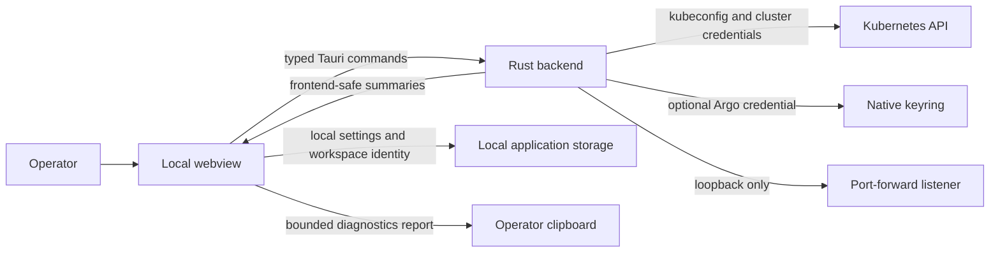

# Safety, data handling, and architecture

KubeCove is local desktop software. It reads Kubernetes data through selected kubeconfig contexts and performs exposed typed operations. It deploys no cluster agent and provides no general local-shell bridge.

## Local data

Local settings persist global display, YAML, session, and Secret-redaction preferences plus saved Argo server profile metadata and workspace identity. Argo credentials are not stored in settings.

Kubeconfig source settings persist in application configuration: selected environment-variable name, added file paths, and source-label preference. Kubeconfig files, client credentials, tokens, and certificates remain backend-side and are not returned in command payloads.

Workspace export is user-directed through native file dialogs. Treat exported workspace files as operational metadata; inspect before sharing.

## Credentials and Argo CD

Argo CD connection setup belongs in the Argo CD category in **Settings**. Open Settings from an active workspace and cluster context to discover or connect a server. Application details uses matching profiles and the selected transport; it does not manage connection profiles. A server profile can be saved without credential. Selecting **Remember credential in native keyring** stores credential in operating-system keyring; otherwise credential is session-only. Custom CA material and invalid-certificate acceptance are session-only. Enabling invalid-certificate acceptance disables certificate validation for that session; use only for trusted diagnosis, then disconnect.

Argo API and Kubernetes CRD access are separate transports. Connected inspection can visibly fall back to Kubernetes when a required connected read fails; the result preserves the connected failure and its Kubernetes provenance. Reviewed operations do not switch transports after confirmation.

## Secrets

Secret values are redacted by default in resource details and YAML. Reveal reads one selected Secret key through backend command path. Reveal only when authorized; do not copy value into logs, tickets, or shared reports.

Selected-resource YAML apply blocks core `v1` Secrets because redacted values could corrupt live data. Connected Argo Secret fields remain redacted.

## Diagnostics and reports

Diagnostics are disabled by default and bounded in memory. Clearing diagnostics removes collected frontend and backend events. Copied latency reports redact identifiers by default; **Include identifiers** opts into sharing them. Review copied report before sending outside trusted support channel.

## Local listeners and desktop boundary

Service port forwards bind loopback address only, so local processes can reach forwarded port but network peers cannot. Pod exec, port-forward, resource inspection, YAML, and guarded operations cross webview boundary only through registered typed Tauri commands. Backend validates scope and returns frontend-safe data; it exposes no generic shell or raw-kubeconfig endpoint.

## Report issue safely

Open [documentation issue](https://github.com/Timpan4/kubecove/issues/new) with symptom, sanitized context, operation, and safe reproduction steps. Remove Secret values, tokens, kubeconfig contents, private hostnames, and copied identifiers unless disclosure is necessary and channel is approved. For vulnerabilities, use [security policy](https://github.com/Timpan4/kubecove/security/policy).
